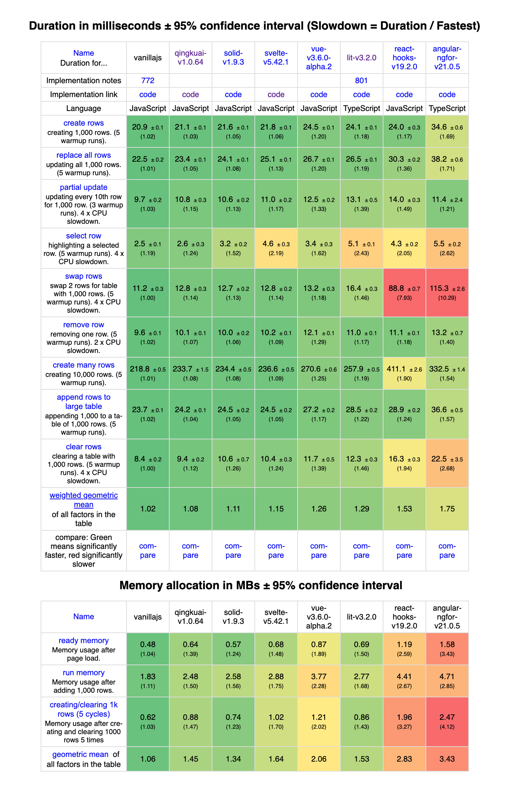
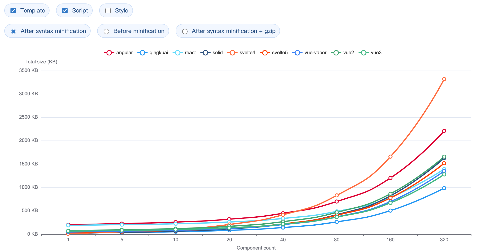

# Qingkuai

<a href="https://qingkuai.dev">
    
</a>

[](https://github.com/qingkuai-js/qingkuai/actions/workflows/ci.yml)
[](https://github.com/qingkuai-js/qingkuai/actions/workflows/e2e-nightly.yml)
[](https://codecov.io/gh/qingkuai-js/qingkuai)
[](https://github.com/qingkuai-js/qingkuai/tree/main/tests/e2e)

Qingkuai is a compiler-based frontend framework for building web interfaces. It transforms `.qk` source files into minimal, strictly optimized JavaScript.

Learn more at [Qingkuai Docs](https://qingkuai.dev), or try it out in the [Playground](https://try.qingkuai.dev).

## Why Qingkuai

- **Architecture**: Compile-time checking & performance optimization, fine-grained updates.
- **Bundle Size**: Runtime only 5KB–11KB (gzip), compiled size [20%–80%](https://mlgq.github.io/frontend-framework-bundle-size/?lang=en) of other frameworks.
- **Reactivity**: Full [reactive support](https://qingkuai.dev/basic/reactivity.html#reactivity-declaration) with [compiler-auto-inferred](https://qingkuai.dev/references/reactivity-infer-rules.html), no manual handling needed.
- **Developer Experience**: Native JS/TS-like experience inside script blocks, Try in [Palyground](https://try.qingkuai.dev).
- **Debugging Experience**: Enhanced [debugging](https://qingkuai.dev/misc/debugging.html) with source-matched and directive context identifiers.
- **Language Services & AI**: Full [language services](https://marketplace.visualstudio.com/items?itemName=qingkuai-tools.qingkuai-language-features) and [mcp server](https://www.npmjs.com/package/qingkuai-mcp-server) for better AI-assisted development.

## Js Framework Benchmark

[](https://krausest.github.io/js-framework-benchmark/2026/chrome148.html)

## Bundle Size Report

[](https://mlgq.github.io/frontend-framework-bundle-size/?lang=en)

## Quick Start

```bash
npm create qingkuai my-app && cd ./my-app
npm install && npm run dev
```

## Contributing

Please see the [Contributing Guide](CONTRIBUTING.md) for details on how to contribute to QingKuai.

## License

[MIT](LICENSE) © 2024-present, all contributors to qingkuai
